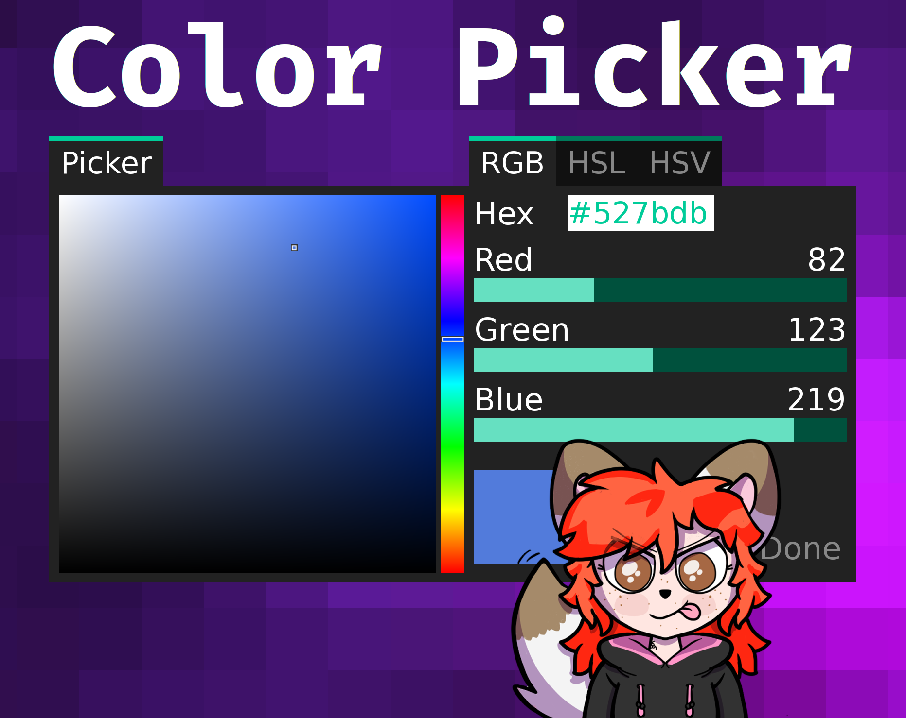

= Ren'Py Color Picker

Provides a new color picker screen that may be called to allow users to pick a
color.  The screen returns the selected color when the user presses 'Done'.

== Usage

For a full usage example see link:game/script.rpy[`script.rpy`].

== License

This source code and project are released under the MIT license, which to
paraphrase in a way that is not legally binding:

* You can use it for free things
* You can use it for paid things
* You can modify it however you see fit
* You can redistribute it as you see fit
* Go nuts!

For a better breakdown of what the license actually means see:
https://choosealicense.com/licenses/mit/

I do ask that you credit me in some way, but if you don't I'm not gonna call the
open-source police on you.  If you do choose to credit me you can do so by
providing a link to my link:https://github.com/Foxcapades[GitHub], my
link:https://foxcapades.itch.io/[Itch.io], or just call me Foxcapades.